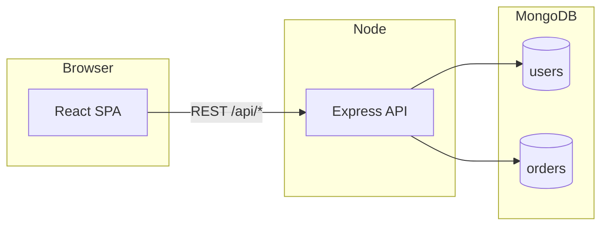

# Tiffin orders — features and implementation

For **setup, environment variables, run commands, and a compact API table**, see [README.md](README.md). This document describes **product behavior** and **how the client and server implement it**.

## Purpose

Internal tool for recording daily thali (tiffin) orders per user. **Totals and validation are authoritative on the server**; the client previews amounts via the same rules. There is **no authentication** in this version.

## High-level architecture

The browser loads a **Vite + React** SPA. All data goes through **REST** JSON endpoints under `/api`. The **Express** server persists data in **MongoDB** (collections `users` and `orders`).

The client resolves the API base URL from `import.meta.env.VITE_API_URL` (see [client/src/api.js](client/src/api.js)); if unset, it defaults to `http://localhost:5000`.

## Server

### Stack and entry

- Source is **TypeScript** under `server/src/`; **`npm run build`** emits **`server/dist/`** (run **`node dist/index.js`** in production).
- **[server/src/index.ts](server/src/index.ts)** loads `dotenv`, creates the Express app, applies **`cors`** and **`express.json()`**, mounts **`/api/users`** and **`/api/orders`**, and connects **Mongoose** before listening on **`PORT`** (defaults to **5000**; **`MONGODB_URI`** is required).
- **CORS** (`isAllowedCorsOrigin`): allows `http`/`https` origins whose host is **`localhost`** or **`127.0.0.1`**; additional exact origins can be listed in **`CORS_ORIGINS`** (comma-separated). Other origins are rejected.
- A generic **500** handler returns `{ error: "Internal server error" }` for uncaught errors.

### Data models

- **[server/src/models/User.ts](server/src/models/User.ts)** — `users` collection: `name`, `phone`, `address` (optional string), `createdAt`.
- **[server/src/models/Order.ts](server/src/models/Order.ts)** — `orders` collection:
  - `userId` (ObjectId, ref User), `dateKey` (`YYYY-MM-DD`, indexed with `userId` **unique** per calendar day).
  - `thaliIds` (array of numbers); legacy **`thaliId`** (single) is deprecated but still read by the API.
  - `extraItems`: `roti`, `sabji`, `dalRice`, `rice` (non-negative counts).
  - `totalAmount` (computed server-side), `createdAt`.
  - **`deletedAt`**: `null` or missing = active order; set to a **Date** = **soft-deleted** (hidden from list/get until restored by a new save).

### Pricing logic

- **[server/src/pricing.ts](server/src/pricing.ts)** exports **`THALI_PRICES`** (menu types `1`–`5`), **`EXTRA_UNIT_PRICES`**, and **`calculateTotal({ thaliIds, extraItems })`**.
- Thali cost is the **sum** of each selected thali’s price (the same type may appear **multiple times** in `thaliIds`).
- Extra lines multiply unit counts by their unit prices. Invalid thali ids or non-integer / negative extras throw with codes such as `INVALID_THALI` / `INVALID_EXTRA`, mapped to **400** responses in routes.

### Users API

- **[server/src/routes/users.ts](server/src/routes/users.ts)**
  - `POST /` — create user; requires `name` and `phone`; optional `address`.
  - `GET /` — list users, newest first.
  - `GET /:id` — single user or **404**.

### Orders API

- **[server/src/routes/orders.ts](server/src/routes/orders.ts)** centralizes payload shaping and responses (uses **`HttpError`** / **`mapPricingErrorToHttp`** for **400**s).

**Normalization**

- **`normalizeThaliIds`**: accepts **`thaliIds`** as an array of integers **1–5**, or legacy **`thaliId`** as a single selection; empty array if none.
- **`normalizeExtraItems`** / **`orderPayloadFromBody`**: builds `dateKey` (from `body.date` or **today** in server local calendar), runs **`calculateTotal`**, and normalizes `extraItems` to numeric counts (missing → 0).

**Responses**

- **`mergedThaliIds`** / **`serializeOrder`**: API responses always expose **`thaliIds`** (merged from legacy `thaliId` when needed). **`deletedAt` is omitted** from serialized JSON.

**Routes (behavior)**

| Handler | Role |
|--------|------|
| `POST /preview` | **`calculateTotal`** only; returns `{ totalAmount }`; no DB write. |
| `POST /` | Validates `userId`, upserts order for `userId` + `dateKey` via **`buildOrderUpdate`** (`$set` includes **`deletedAt: null`**, `$unset` **`thaliId`**). **201** with `order` + `totalAmount`. |
| `PUT /:userId` | Same payload as POST; requires an **active** row (`deletedAt: null`) for that `userId` + `dateKey`, else **404**. |
| `DELETE /:userId?date=` | Soft-delete: sets **`deletedAt`** if an active row exists; **204** or **404**. |
| `GET /` (history) | Query: **`from`**, **`to`** (`YYYY-MM-DD`; defaults **today**; `to` defaults to `from`); optional **`userId`**. Filter **`deletedAt: null`**, `dateKey` in range, **`from` ≤ `to`**. Populates `user` `{ name, phone }` on each row. |
| `GET /:userId?date=` | Single order for user + date (**today** if `date` omitted), **active only**; **404** if missing. |

## Client

### Stack and routing

- **Vite** + **React Router** — routes defined in [client/src/App.jsx](client/src/App.jsx):
  - `/` — **Home** dashboard (last-month stats and charts, four recent orders, user list)
  - `/users` — Users list
  - `/users/new` — Add user
  - `/history` — Order history
  - `/invoice` — Monthly invoice-style view
  - `/order` — Create / update / delete order

Layout includes nav links and a **theme** `<select>` (System / Light / Dark).

### API layer

- **[client/src/api.js](client/src/api.js)** — `fetch` wrappers for users, `previewOrder`, `createOrder`, `updateOrder`, `deleteOrder`, `getOrderForUser`, `getOrdersHistory` (supports `from`, `to`, `userId`). Base URL as above.

### Pages (features and logic)

| Page | File | Behavior |
|------|------|----------|
| Home | [client/src/pages/HomePage.jsx](client/src/pages/HomePage.jsx) | `getUsers` + `getOrdersHistory` (previous month + 120-day window); stat cards; **Recharts** bar charts (expence labels); four global recent orders; user cards with last-month counts/amounts. |
| Users | [client/src/pages/UsersPage.jsx](client/src/pages/UsersPage.jsx) | Lists users; links to add user and open order flow with `userId`. |
| Add user | [client/src/pages/AddUserPage.jsx](client/src/pages/AddUserPage.jsx) | Form → `createUser`; redirects to `/users`. |
| Order | [client/src/pages/OrderPage.jsx](client/src/pages/OrderPage.jsx) | Dynamic thali rows, extras, **Calculate** → `previewOrder`, **Save** → `createOrder`, **Update** → `updateOrder`, **Delete** → `deleteOrder` (soft-delete). User from URL `?userId=` or **localStorage**; date via `<input type="date">` or optional `?date=YYYY-MM-DD`. |
| History | [client/src/pages/HistoryPage.jsx](client/src/pages/HistoryPage.jsx) | `getUsers` + `getOrdersHistory` with date range and optional user; **Clear filters** resets to today and all users; table shows thali summary and totals. |
| Invoice | [client/src/pages/InvoicePage.jsx](client/src/pages/InvoicePage.jsx) | Derives month `from`/`to`, calls `getOrdersHistory` (optional **same `userId` filter** as History); **groups rows by user** in the UI, subtotals + grand total (label adjusts when filtered). |

### Utilities

- **[client/src/utils/dateFormat.js](client/src/utils/dateFormat.js)** — **`formatDateDDMMYYYY`**: display **`dd-mm-yyyy`** from API/storage **`yyyy-mm-dd`**.
- **[client/src/utils/thaliFormat.js](client/src/utils/thaliFormat.js)** — **`formatThaliQuantities`**: human-readable thali lines (e.g. counts per type) for tables.

### Theme

- **[client/src/theme/ThemeContext.jsx](client/src/theme/ThemeContext.jsx)** — `system` | `light` | `dark`; preference stored in **`localStorage`** under **`tiffin_theme`**; respects `prefers-color-scheme` when set to system.

## Cross-cutting rules

- **Calendar date** for an order is always **`dateKey`** in **`YYYY-MM-DD`** on the wire and in the DB; the UI may show **`dd-mm-yyyy`** for readability.
- **One document per (`userId`, `dateKey`)** thanks to the unique index; saving again **replaces** that document and **clears soft-delete** (`deletedAt`).
- **Soft delete** hides the order from **`GET /api/orders`** (list and single) until a new **POST** (or successful flow that upserts) writes an active row again.
- **Legacy `thaliId`** is still read and merged into **`thaliIds`** in API responses; new writes use **`thaliIds`** and **`$unset` `thaliId`** on upsert.
- **Duplicate entries in `thaliIds`** are valid: each entry is priced like an extra plate of that thali type.

## See also

- [README.md](README.md) — prerequisites, configuration, how to run locally, and the API summary table.
